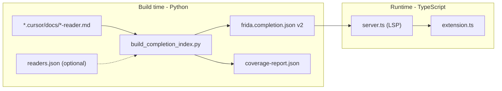

# Implement syntax insertion for all FRIDA functions

## Objective

Make autocomplete present **selectable documented syntax variants** for all readers and Mix functions. When canonical syntax is unavailable, do **not** insert fabricated templates; surface that gap through metadata, ordering, and coverage reporting.

---

## Architecture overview



---

## Step 1: Rewrite `extract_function_sections()` in `build_completion_index.py`

**File:** [`vscode-frida-extension/scripts/build_completion_index.py`](c:/FRIDA/TuringExpo/Local/1555960/0/vscode-frida-extension/scripts/build_completion_index.py)

### 1A. Replace `##`-level splitting with `### FunctionName` parsing

Current code (lines 64-98) splits on `r"^##\s+([^\n#]+)\s*$"`. Replace with a two-level approach:

1. Find the `## Functions` section boundary (start = after `## Functions` heading, end = next `## ` heading or EOF).
2. Inside that boundary, split on `### ` headings using `r"^###\s+([^\n#]+)\s*$"` with `re.MULTILINE`.
3. Each match group(1) is the function name; each section body runs from match.end() to the next `### ` or the `## Functions` boundary end.

Keep the existing `extract_keyword()`, `extract_reader_name()`, and `extract_quick_reference()` functions unchanged.

### 1B. Extract only `**Syntax:**` fenced blocks, reject `**Examples:**`

Inside each `### FunctionName` section body, use a state machine (not the current global regex):

1. Scan line by line.
2. Track the current "sub-heading" context by detecting bold-label lines matching `r"^\*\*(\w[\w\s/]*):\*\*"` (captures labels like `Syntax`, `Examples`, `Parameters`, `Options`).
3. When inside a fenced block (between opening ` ``` ` and closing ` ``` `):
   - If the current sub-heading is `Syntax` -> **accept** the block as canonical syntax.
   - If the current sub-heading is `Examples` or `Example` -> **reject** (skip entirely).
   - If the current sub-heading is anything else or none -> **reject**.

### 1C. Parse accepted syntax blocks into variants

Each accepted fenced block contains one or more syntax lines. Each non-empty line is one **variant**. Parse each variant:

```python
@dataclass
class SyntaxVariant:
    raw: str            # full line as-is, e.g. "SAP ClickGridButton GridId <GridId> RowN <Row>"
    stripped: str        # prefix-stripped, e.g. "ClickGridButton GridId <GridId> RowN <Row>"
    syntaxSource: str    # "docs" when from markdown, "readers" when from readers.json
```

**Prefix stripping logic:** Given the reader's `keyword` (e.g. `"SAP"`, `"Excel"`, `"Web2"`), if a raw line starts with `keyword + " "` (case-insensitive), `stripped` = line with that prefix removed. Otherwise `stripped` = same as `raw`. For Mix functions (keyword is `""`), `stripped` always equals `raw`.

**Deduplication:** After collecting all variants for one function, remove exact duplicates where `raw` strings are identical after `.strip()`. Keep the first occurrence. Do not collapse variants whose `raw` differs even if `stripped` matches.

### 1D. Regression assertion

After building the full reader list, add:

```python
for reader in readers:
    for fn in reader["functions"]:
        assert fn["name"] != "Functions", (
            f"Bogus aggregate entry 'Functions' found in reader '{reader['name']}'. "
            "This indicates extract_function_sections is still splitting on ## instead of ###."
        )
```

Run this assertion unconditionally, not behind a flag. It fails the build if the bug recurs.

### 1E. Merge policy for `merge_readers_json()`

Replace the current unconditional overwrites (lines 173-179) with per-field precedence:

```python
# syntax: docs-first; readers fills only when docs is empty
if not item.get("syntax"):
    item["syntax"] = [
        {"raw": s, "stripped": s, "syntaxSource": "readers"}
        for s in fn.get("Syntax", [])
    ]

# shortDescription / description: docs-first; readers fills empty
if not item.get("shortDescription"):
    item["shortDescription"] = str(fn.get("ShortDescription", ""))
if not item.get("description"):
    item["description"] = str(fn.get("Description", ""))

# params: union-merge (add params not already present)
existing_params = set(item.get("params", []))
for p in fn.get("Params", []):
    if p not in existing_params:
        item.setdefault("params", []).append(p)

# examples: append-only (readers examples added after docs examples)
item.setdefault("examples", []).extend(fn.get("Example", []))
```

---

## Step 2: New index schema (`schemaVersion: 2`)

### 2A. Generated JSON shape

```json
{
  "schemaVersion": 2,
  "readers": [
    {
      "keyword": "SAP",
      "name": "SAP Reader",
      "functions": [
        {
          "name": "ClickGridButton",
          "shortDescription": "Clicks a button inside a grid cell...",
          "description": "Clicks a button inside a grid cell...",
          "syntax": [
            {
              "raw": "SAP ClickGridButton GridId <GridId> RowN <Row>",
              "stripped": "ClickGridButton GridId <GridId> RowN <Row>",
              "syntaxSource": "docs"
            },
            {
              "raw": "SAP ClickGridButton GridId <GridId> RowN <Row> Column \"<ColumnName>\"",
              "stripped": "ClickGridButton GridId <GridId> RowN <Row> Column \"<ColumnName>\"",
              "syntaxSource": "docs"
            }
          ],
          "params": ["GridId", "Row", "ColumnName", "Value"],
          "examples": []
        }
      ]
    }
  ]
}
```

Functions with no syntax get `"syntax": []` (empty array, not a `"missing"` object). The `syntaxSource` field only exists on actual variant objects.

### 2B. TypeScript types in `server.ts`

Replace the current types (lines 16-34) with:

```typescript
type SyntaxVariant = {
  raw: string;
  stripped: string;
  syntaxSource: "docs" | "readers";
};

type FridaFunction = {
  name: string;
  shortDescription?: string;
  description?: string;
  syntax?: SyntaxVariant[];
  params?: string[];
  examples?: string[];
};

type FridaReader = {
  keyword: string;
  name: string;
  functions: FridaFunction[];
};

type CompletionIndex = {
  schemaVersion: number;
  readers: FridaReader[];
};
```

### 2C. Schema version guard in `loadIndex()`

After `JSON.parse`, check `schemaVersion`:

```typescript
function loadIndex(path: string): void {
  try {
    const raw = fs.readFileSync(path, "utf-8");
    const parsed = JSON.parse(raw) as CompletionIndex;
    if (parsed.schemaVersion !== 2) {
      connection.console.error(
        `Completion index schemaVersion ${parsed.schemaVersion} is not supported (expected 2). ` +
        `Run 'npm run build:index' to regenerate.`
      );
      completionIndex = { schemaVersion: 2, readers: [] };
      return;
    }
    completionIndex = parsed;
  } catch (error) {
    connection.console.error(`Failed to load completion index: ${String(error)}`);
    completionIndex = { schemaVersion: 2, readers: [] };
  }
}
```

### 2D. Update all syntax consumers

**Completion detail** (currently `fn.syntax?.[0]` at lines 109, 136):

```typescript
fn.syntax?.[0]?.raw ?? `${reader.keyword} ${fn.name}`
```

**Hover syntax block** (currently joins as strings at line 195):

```typescript
const syntaxBlock = (fn.syntax ?? [])
  .slice(0, 4)
  .map((v) => v.raw)
  .join("\n");
```

---

## Step 3: Rewrite `onCompletion` in `server.ts`

### 3A. New token parsing and completion branches

Replace the current handler (lines 82-144) with three branches:

```
Branch A: tokens.length >= 1, first token is a reader keyword, trailing space present
          -> show that reader's functions (one item per syntax variant)

Branch B: tokens.length >= 2, first token is reader keyword, second token is partial function name (no trailing space)
          -> filter that reader's functions by partial match, show matching variants with textEdit replacement

Branch C: tokens.length <= 1, no reader keyword matched
          -> show reader keywords + Mix functions (one item per syntax variant)
```

Exact gating logic:

```typescript
connection.onCompletion((params): CompletionItem[] => {
  const doc = documents.get(params.textDocument.uri);
  if (!doc) return [];

  const lineText = doc.getText({
    start: { line: params.position.line, character: 0 },
    end: params.position,
  });
  const prefixTrimmed = lineText.trimStart();
  if (!prefixTrimmed || prefixTrimmed.startsWith("#")) return [];

  const leadingWhitespace = lineText.length - lineText.trimStart().length;
  const byKeyword = keywordMap();
  const tokens = prefixTrimmed.split(/\s+/).filter(Boolean);
  const hasTrailingSpace = /\s$/.test(prefixTrimmed);
  const items: CompletionItem[] = [];

  const firstTokenReader = tokens.length >= 1
    ? byKeyword.get(tokens[0].toLowerCase())
    : undefined;

  if (firstTokenReader && tokens.length === 1 && hasTrailingSpace) {
    // Branch A: "SAP " -> show all functions for SAP reader
    return buildReaderFunctionItems(firstTokenReader, params, "after-keyword");
  }

  if (firstTokenReader && tokens.length >= 2 && !hasTrailingSpace) {
    // Branch B: "SAP Wri" -> filter + replace partial token
    const partial = tokens[tokens.length - 1].toLowerCase();
    const partialStart = lineText.lastIndexOf(tokens[tokens.length - 1]);
    return buildReaderFunctionItems(firstTokenReader, params, "partial-token", partial, partialStart);
  }

  // Branch C: line start -> reader keywords + Mix functions
  // (existing behavior, enhanced with variant items)
  for (const reader of completionIndex.readers) {
    if (reader.keyword) {
      items.push({
        label: reader.keyword,
        kind: CompletionItemKind.Module,
        detail: reader.name,
        documentation: `Reader keyword: ${reader.keyword}`,
      });
    }
  }
  const mix = mixReader();
  if (mix) {
    items.push(...buildReaderFunctionItems(mix, params, "line-start"));
  }
  return items;
});
```

### 3B. `buildReaderFunctionItems()` helper

This function is the core of syntax-variant completion. Implement it as follows:

```typescript
function buildReaderFunctionItems(
  reader: FridaReader,
  params: CompletionParams,
  context: "after-keyword" | "partial-token" | "line-start",
  partial?: string,
  partialStartChar?: number,
): CompletionItem[] {
  const items: CompletionItem[] = [];
  const functions = partial
    ? reader.functions.filter((fn) => fn.name.toLowerCase().startsWith(partial))
    : reader.functions;

  for (const fn of functions) {
    const variants = fn.syntax ?? [];

    if (variants.length === 0) {
      // No canonical syntax -> name-only fallback, deprioritized
      items.push({
        label: fn.name,
        kind: CompletionItemKind.Function,
        detail: "(no documented syntax)",
        documentation: fn.description ?? fn.shortDescription ?? "",
        sortText: `3-${fn.name}`,  // ranks last
      });
      continue;
    }

    for (let vi = 0; vi < variants.length; vi++) {
      const variant = variants[vi];
      const insertionText = context === "line-start"
        ? variant.raw       // full form including reader prefix
        : variant.stripped;  // prefix-stripped (cursor already after keyword)

      // Label suffix: use first differing token after function name, else numeric index
      const suffix = variants.length > 1
        ? inferVariantSuffix(variant.raw, fn.name, vi)
        : "";
      const label = suffix
        ? `${fn.name} ${suffix}`
        : fn.name;

      // sortText: docs=1, readers=2, missing=3; then function name; then variant index
      const sourceRank = variant.syntaxSource === "docs" ? "1" : "2";
      const sortText = `${sourceRank}-${fn.name}-${String(vi).padStart(3, "0")}`;

      const item: CompletionItem = {
        label,
        kind: CompletionItemKind.Function,
        detail: variant.raw,
        documentation: fn.description ?? fn.shortDescription ?? "",
        sortText,
        insertTextFormat: InsertTextFormat.PlainText,
      };

      // Use textEdit for partial-token replacement
      if (context === "partial-token" && partialStartChar !== undefined) {
        item.textEdit = TextEdit.replace(
          {
            start: { line: params.position.line, character: partialStartChar },
            end: params.position,
          },
          insertionText,
        );
      } else {
        item.insertText = insertionText;
      }

      items.push(item);
    }
  }
  return items;
}
```

### 3C. `inferVariantSuffix()` helper

Deterministic label suffix rule:

```typescript
function inferVariantSuffix(raw: string, fnName: string, variantIndex: number): string {
  // Remove function name (and optional reader prefix) to get the parameter portion
  const fnPos = raw.toLowerCase().indexOf(fnName.toLowerCase());
  if (fnPos === -1) return `(${variantIndex + 1})`;

  const afterFn = raw.substring(fnPos + fnName.length).trim();
  // Take first token-pair as semantic hint
  const firstParam = afterFn.split(/\s+/).slice(0, 2).join(" ");

  if (firstParam && firstParam.length <= 30) {
    return `-- ${firstParam}`;
  }
  // Fallback: numeric index
  return `(${variantIndex + 1})`;
}
```

### 3D. Required imports to add in `server.ts`

Add to the existing import block:

```typescript
import {
  // ... existing imports ...
  InsertTextFormat,
  TextEdit,
  CompletionParams,
} from "vscode-languageserver/node";
```

### 3E. Update hover handler

Replace syntax rendering (line 195) and detail lines as specified in Step 2D. No other hover changes needed.

---

## Step 4: Ordering (`sortText` strategy)

Already defined in Step 3B above. The `sortText` format is:

```
{sourceRank}-{functionName}-{variantIndex:3digits}
```

- `sourceRank`: `"1"` for docs, `"2"` for readers, `"3"` for missing
- This produces strict `docs > readers > missing` ordering
- Within a function, variants stay in docs-order (stable index)

---

## Step 5: Coverage report script

### 5A. Add `--coverage` flag to `build_completion_index.py`

Add a new CLI argument:

```python
parser.add_argument("--coverage", type=str, default=None,
                    help="Path to write coverage-report.json")
```

### 5B. Coverage report shape

After building the index, compute and write:

```json
{
  "total_functions": 589,
  "total_syntax_variants": 412,
  "functions_with_syntax": 350,
  "functions_missing_syntax": 239,
  "per_reader": [
    {
      "reader": "SAP",
      "functions": 92,
      "with_syntax": 80,
      "missing_syntax": 12,
      "variants": 105
    }
  ],
  "top_missing": ["Web2/AskDownload", "Web2/Authenticate", "..."]
}
```

### 5C. Print summary to stdout

Always print a summary table to stdout after writing the index (regardless of `--coverage` flag):

```
Coverage: 350/589 functions (59.4%), 412 variants
  SAP:     80/92  (86.9%) — 105 variants
  Excel:  150/199 (75.3%) — 210 variants
  ...
```

### 5D. Update `build:index` script in `package.json`

Change:

```json
"build:index": "python ./scripts/build_completion_index.py --docs ../.cursor/docs --out ./resources/frida.completion.json --coverage ./resources/coverage-report.json"
```

### 5E. Baseline gating (deferred, report-only for now)

Do NOT implement baseline comparison yet. Add a placeholder comment in the coverage code:

```python
# TODO: After manual review, commit baseline to test-fixtures/baseline-coverage.json
# and add --baseline flag to compare against it for regression detection.
```

---

## Step 6: Automated tests

### 6A. Python parser tests

**Directory:** `vscode-frida-extension/scripts/tests/`  
**File:** `vscode-frida-extension/scripts/tests/test_build_completion_index.py`  
**Fixtures:** `vscode-frida-extension/test-fixtures/docs/`

**Create fixture file** `vscode-frida-extension/test-fixtures/docs/test-reader.md`:

```markdown
# Test Reader

**Keyword:** `Test`

## Quick Reference

| Function | Description |
|----------|-------------|
| SimpleFunc | A simple function |
| MultiFunc | A function with multiple syntaxes |
| NoSyntaxFunc | A function without syntax |

## Functions

### SimpleFunc

> A simple function.

**Syntax:**

` `` `
Test SimpleFunc Param1 <val>
` `` `

**Examples:**

` `` `
Test SimpleFunc Param1 hello
` `` `

---

### MultiFunc

> Multiple syntax forms.

**Syntax:**

` `` `
Test MultiFunc ById <id>
Test MultiFunc ByName "<name>"
` `` `

**Examples:**

` `` `
Test MultiFunc ById abc123
` `` `

---

### NoSyntaxFunc

> No syntax block here.

A function that only has description but no syntax section.

---
```

(Remove the space in the triple backtick fences above -- they are escaped only for this plan document.)

**Test cases in `test_build_completion_index.py`:**

- `test_function_names_extracted`: Parse `test-reader.md`, assert 3 functions: `SimpleFunc`, `MultiFunc`, `NoSyntaxFunc`. Assert `Functions` is NOT in the function name list.
- `test_syntax_accepted_from_syntax_heading`: `SimpleFunc` has exactly 1 syntax variant with `raw == "Test SimpleFunc Param1 <val>"`, `stripped == "SimpleFunc Param1 <val>"`, `syntaxSource == "docs"`.
- `test_multiple_variants_preserved`: `MultiFunc` has exactly 2 variants.
- `test_examples_rejected`: No syntax variant contains `"hello"` (which appears only in the Examples block).
- `test_no_syntax_yields_empty_list`: `NoSyntaxFunc` has `syntax == []`.
- `test_prefix_stripping`: `SimpleFunc` variant's `stripped` does not start with `"Test "`.
- `test_duplicate_dedup`: If a second identical syntax line is added to the fixture, the parser produces only one variant.

### 6B. TypeScript LSP tests

**Directory:** `vscode-frida-extension/src/test/`  
**File:** `vscode-frida-extension/src/test/completion.test.ts`

Use `vitest`. Tests import the helper functions directly (export `buildReaderFunctionItems`, `inferVariantSuffix`, `keywordMap`, `mixReader` from `server.ts` or extract them into a `vscode-frida-extension/src/completionHelpers.ts` module that `server.ts` imports).

**Test cases:**

- `test_after_keyword_returns_all_variants`: Given a reader with 2 functions (one with 3 variants, one with 1), calling `buildReaderFunctionItems` in `"after-keyword"` context returns 4 items total.
- `test_partial_token_filters`: With partial `"Wri"`, only functions whose name starts with `Wri` are returned.
- `test_partial_token_uses_textEdit`: Items returned in `"partial-token"` context have `textEdit` set, not bare `insertText`.
- `test_line_start_uses_raw`: Items in `"line-start"` context use `variant.raw` as `insertText`.
- `test_after_keyword_uses_stripped`: Items in `"after-keyword"` context use `variant.stripped` as `insertText`.
- `test_sortText_ordering`: Docs variants sort before readers variants; both sort before missing-syntax items.
- `test_label_suffix_deterministic`: A function with 2 variants produces 2 items with distinct labels.

### 6C. Add dependencies and test scripts

In `package.json`, add to `devDependencies`:

```json
"vitest": "^3.1.1"
```

Add to `scripts`:

```json
"test": "vitest run && pytest scripts/tests/",
"test:ts": "vitest run",
"test:py": "pytest scripts/tests/"
```

Add a `vitest.config.ts` at `vscode-frida-extension/vitest.config.ts`:

```typescript
import { defineConfig } from "vitest/config";

export default defineConfig({
  test: {
    include: ["src/test/**/*.test.ts"],
  },
});
```

### 6D. Extract testable helpers from `server.ts`

Create `vscode-frida-extension/src/completionHelpers.ts` containing the pure functions: `buildReaderFunctionItems`, `inferVariantSuffix`. These take data as arguments (no LSP connection dependency) so they are unit-testable.

`server.ts` imports from `completionHelpers.ts` and wires them into the LSP handlers.

---

## Step 7: Manual test matrix (unchanged from previous plan)

No code changes. After implementation, manually test in Dev Host:

- SAP, Excel, File, Word, PPT, DB, Mail, Titanium, Web2, Mix
- Multi-variant selection (e.g. `DefineVariable`)
- Partial-token replacement (e.g. `SAP Wri`, `Excel Rea`)
- Missing-syntax deprioritization for at least one function

---

## Files to change (exhaustive list)

- `vscode-frida-extension/scripts/build_completion_index.py` — rewrite parser, new schema, coverage, merge policy
- `vscode-frida-extension/src/server.ts` — new types, new completion/hover logic, schema guard
- `vscode-frida-extension/src/completionHelpers.ts` — **new file**, extracted pure functions for completion
- `vscode-frida-extension/package.json` — add `vitest` dep, test scripts, update `build:index`
- `vscode-frida-extension/vitest.config.ts` — **new file**, vitest configuration
- `vscode-frida-extension/scripts/tests/test_build_completion_index.py` — **new file**, Python parser tests
- `vscode-frida-extension/test-fixtures/docs/test-reader.md` — **new file**, test fixture
- `vscode-frida-extension/src/test/completion.test.ts` — **new file**, TypeScript completion tests
- `vscode-frida-extension/resources/frida.completion.json` — regenerated with schema v2
- `vscode-frida-extension/README.md` — document schema v2, test commands, pytest requirement

---

## Success criteria

- A function with multiple documented syntaxes appears as multiple selectable completion entries, one per syntax variant
- Selecting a function with canonical syntax inserts the chosen documented syntax variant and replaces any partially typed token correctly
- Mix functions like `DefineVariable` expose their documented variants and insert the chosen canonical syntax pattern
- Non-SAP readers have working syntax insertion coverage, with gaps visible in per-reader coverage output
- Build output includes measurable syntax coverage summary and per-reader breakdown
- The generated completion index uses `schemaVersion: 2` with `SyntaxVariant` objects
- `npm test` runs both Python and TypeScript test suites and all tests pass
