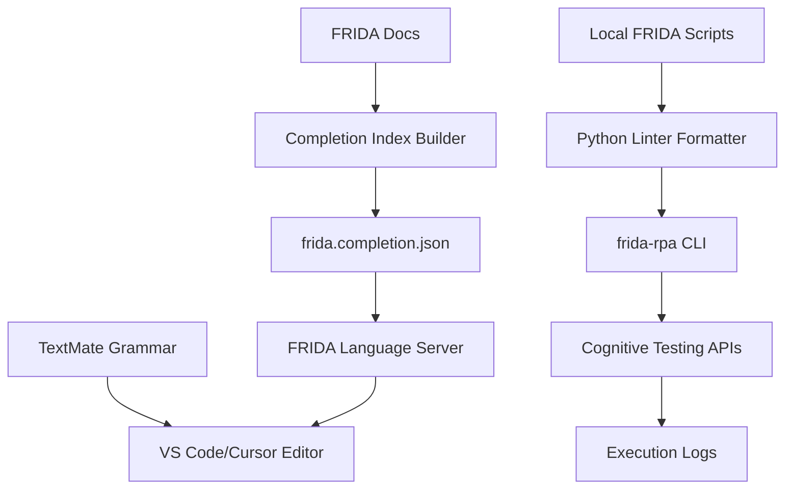

# FRIDA Editor Tools - Leadership Q&A

This document is designed for conversations with leadership about what the project does, how it works, and why it matters.

## Executive Summary

### What is this project?

It is a VS Code/Cursor extension plus local CLI and Python tooling that gives FRIDA automation scripts real language tooling: syntax highlighting, hover help, completions, linting/formatting, and Cognitive sync/log workflows.

### What problem does it solve?

FRIDA scripts are plain `.txt` files, so teams typically lack guardrails. This project adds IDE feedback and automated checks to reduce script errors before upload/execution.

### Who benefits?

Automation developers, FRIDA script maintainers, and team leads who need more consistent scripts, faster troubleshooting, and fewer avoidable runtime failures.

### Why does it matter to the business?

- Fewer manual mistakes in FRIDA scripts.
- Faster authoring and review cycles.
- More consistent upload/pull/log processes with Cognitive.
- Better maintainability as the number of scripts grows.

## Technology Stack

### Which languages is the project built with?

- TypeScript: extension, language server, CLI.
- Python: completion-index generation, lint/format checks, Cognitive sync/pull/log tooling.
- JSON: grammar/snippets/completion index/config.

### Why TypeScript and Python together?

TypeScript is the natural fit for VS Code/Cursor APIs and language tooling. Python is used for text-processing and automation scripts that are easy to run in terminal workflows.

### Is there a backend service?

No project-owned backend is required. The tooling runs locally and calls existing Cognitive cloud endpoints for upload/download/log operations.

## How The Extension Understands FRIDA

### How does the editor know FRIDA language?

The extension registers a custom language id named `frida` and can auto-assign that language to matching `.txt` files using configurable glob patterns (`frida.filePatterns`).

### How are FRIDA files recognized?

When files are opened, the extension checks configured patterns (for example `**/Actions.txt`) and sets the document language to `frida`.

### How does syntax highlighting work?

A TextMate grammar (`syntaxes/frida.tmLanguage.json`) defines patterns for FRIDA comments, variables (`<<<>>>`, `<<>>`, `{}`), control flow keywords, reader prefixes (SAP/Excel/Web/etc.), and operators.

### How does language behavior work in editor?

Language configuration provides FRIDA-specific comment token (`##`), bracket/quote pairing, auto-closing for `<<< >>>`, and region folding markers (`#%region` / `#%endregion`).

### How do hover and autocomplete work?

A Language Server Protocol (LSP) server reads `resources/frida.completion.json` at startup, then:

- offers reader/function completions based on cursor context;
- provides hover text with descriptions and syntax variants.

## Completion Data Flow

### Where do completion suggestions come from?

From local FRIDA documentation in `resources/frida-docs`, converted into a normalized completion index.

### How is that index built?

The script `scripts/build_completion_index.py` parses docs and writes `resources/frida.completion.json` (with optional coverage output).

### Why is this design useful?

Documentation updates can flow directly into editor completions without rewriting the language server code each time.

## Linter And Formatter

### How does linting work?

The Python linter (`resources/cli-tools/frida_lint.py`) parses FRIDA scripts line-by-line, classifies structure (instructions, comments, block openings/closures, regions), and emits diagnostics by rule code.

### What does it validate?

- Structure and formatting consistency.
- Block and indentation correctness.
- Style/safety conventions.
- ASCII safety normalization for Cognitive upload scenarios (W019-related workflow).
- Optional rule suppression using `noqa` comments.

### Can it auto-fix?

Yes. It supports `format` and `check --fix` passes, with safe/unsafe fix controls and verification modes.

### How are sub-scripts handled?

`--follow-scripts` can include `RunScript` targets so lint/fix covers both the main script and referenced scripts, reducing hidden downstream breakage.

### Why this helps leadership goals

It shifts failures left: more issues are caught during authoring instead of during Cognitive execution.

## Cognitive Integration

### How does push to Cognitive work?

The sync script posts file payloads to Cognitive cloud endpoints (for example create/list operations under `Processes/{pid}/Steps/{step}` paths), matching the upload sequence used by the web experience.

### What files are included?

Core files include `Actions.txt`, `datadrive.txt`, and `headers.txt`; local `RunScript` targets are also included when present.

### How are upload failures prevented?

By default, the sync flow sanitizes non-ASCII content for Azure compatibility and can report when sanitization happened.

### Can we pull from Cognitive?

Yes. `fetch_actions_from_cognitive.py` downloads `Actions.txt` for a process/step, with options like dry-run, backup, and newline handling.

### Can we retrieve logs?

Yes. Dedicated scripts list available runs and download selected/latest log files from Cognitive result paths.

## CLI Workflow (`frida-rpa`)

### Why have a CLI if we already have an extension?

The CLI standardizes terminal workflows (open, status, lint, fix, push, pull, logs) and ties editor/lint/Cognitive operations into repeatable commands.

### Typical daily flow

1. `frida-rpa status`
2. `frida-rpa lint`
3. `frida-rpa fix`
4. `frida-rpa push` (or `pull`/`logs` as needed)

### What protects quality during push?

Push runs a lint-safe pipeline (format -> fix -> format -> verify) and blocks upload if lint still reports problems.

### How does `frida-rpa login` store credentials?

On first use (or after logout), `login` prompts for Cognitive email and password. The password is sent to the Cognitive/Firebase sign-in flow only to verify the account. After a successful check:

- **Non-secret metadata** is written to `~/.frida-rpa/session.json` (for example the email and timestamps). This file is suitable for features that need the user identity, such as defaulting the email for `logs` commands.
- The **password is not stored in that JSON file.** It is persisted using **Windows data protection (DPAPI)** via a small local helper: an encrypted blob is written under `~/.frida-rpa/credentials/`, scoped to the signed-in Windows user on that machine.

### Do credentials “expire” after a few hours?

No artificial CLI session window. The local login remains valid until the user runs `frida-rpa logout`, deletes the stored files, or the OS-level secure material is removed. (Short-lived API tokens, if we add them later, would follow the provider’s real expiry; the password storage above is for durable local use until logout.)

### How does logout work?

`frida-rpa logout` removes the session metadata file and deletes the stored password material for the current session email, so the next run will prompt for credentials again.

### Why not keep only email and skip the password file?

Some workflows already need the email; future Cognitive or Firebase-authenticated calls may need the password or a token derived from it. Storing the verified password in OS-protected storage keeps that option without putting secrets in plain JSON.

## Testing And Quality

### How is quality verified?

- TypeScript tests (Vitest) cover extension/LSP/CLI behavior.
- Python tests (Pytest) cover completion index generation/parsing.

### Why this matters

The project validates both editor-facing logic and tooling pipelines, reducing regressions when docs/rules/features evolve.

## Architecture Diagram

## Suggested Talking Points For Leadership

- This is a productivity and quality platform for FRIDA script development, not just syntax coloring.
- It formalizes how scripts are authored, validated, and synchronized with Cognitive.
- It reduces operational risk by catching script issues before execution.
- It is extensible: docs can drive completions, and lint rules can evolve as team standards mature.
- It gives us a repeatable workflow that scales better as automation footprint grows.

## Glossary

- TextMate grammar: syntax rules used by editors for highlighting/tokenization.
- LSP (Language Server Protocol): standard protocol enabling completions/hover/diagnostics.
- Completion index: generated JSON catalog of FRIDA readers/functions/syntax for autocomplete.
- Cognitive process/step: storage path model used by Cognitive for automation files.
- RunScript: FRIDA instruction to execute a sub-script file from a main script.
- DPAPI: Windows Data Protection API; used by the CLI to protect locally stored password material per user profile on a given machine.

